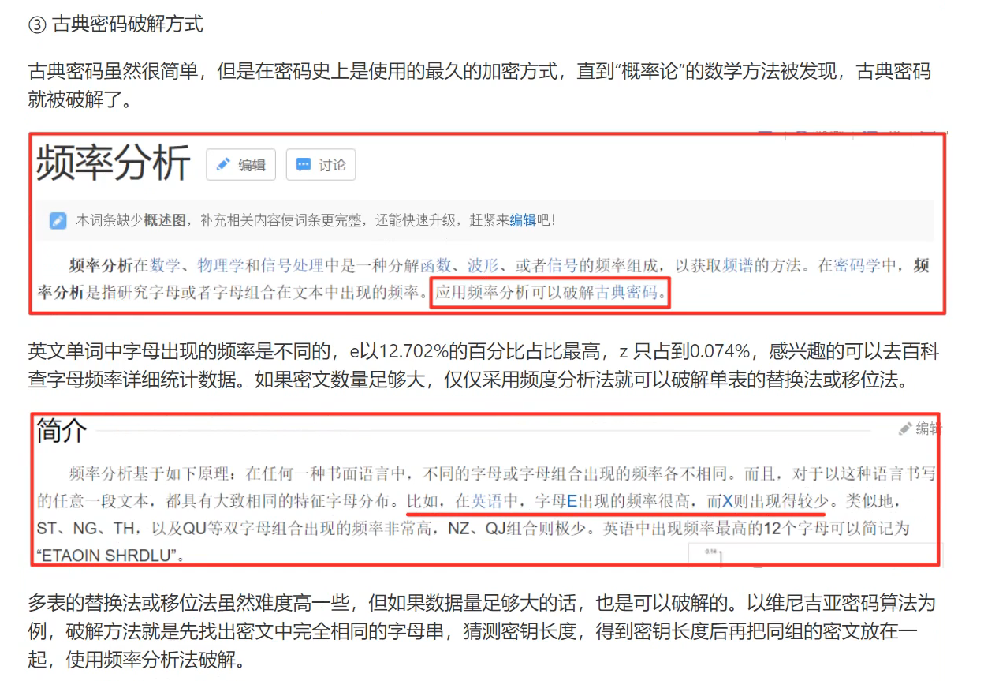
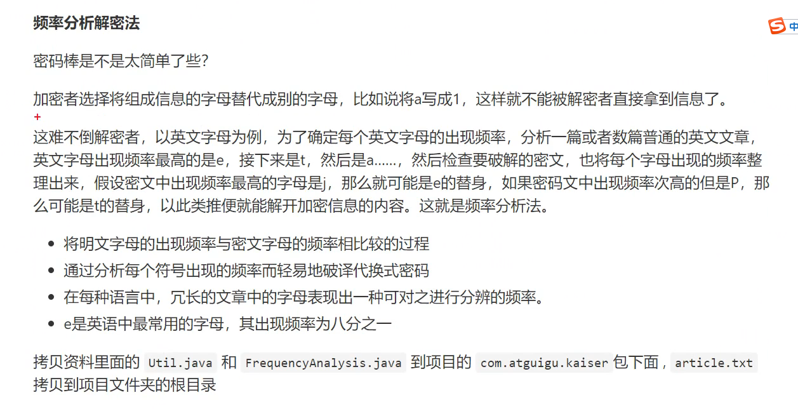
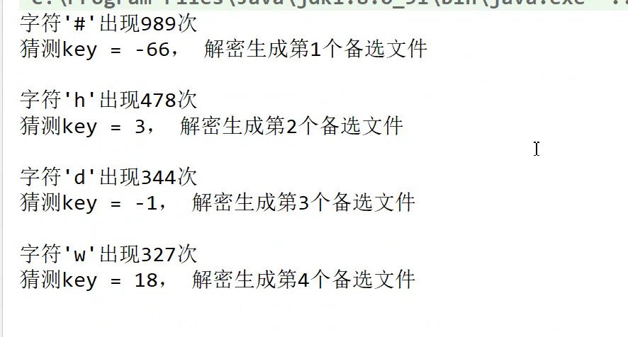

###频率分析法破解凯撒加密

 
[ 目的： 在不知道秘钥的情况下，也想进行破解密文
]
[ 原理：
    比如一英文为例:字母e,出现的频率是最高的，
    第二个评率最高的是t，然后是a，
  当我们拿到密文的时候，密文里也会出现一个频率最高的字母，
  假设密文里出现频率最高的字母是j，可以假设密文里的j就是明文里的e,
  假设密文里出现频率第二高的的字母，假设是在明文当中的t
  
 ]
 对应频率的字母,猜key
 
 
 ===
  对应频率的字母,猜key
 
 